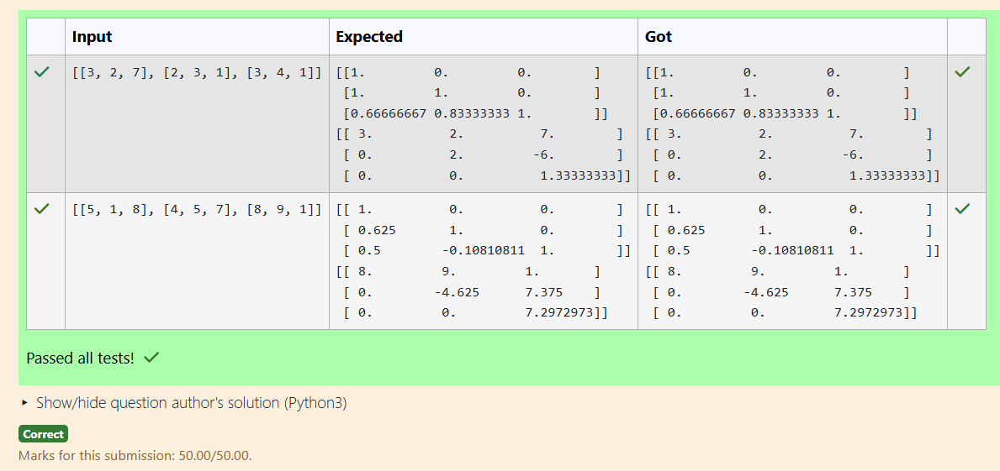
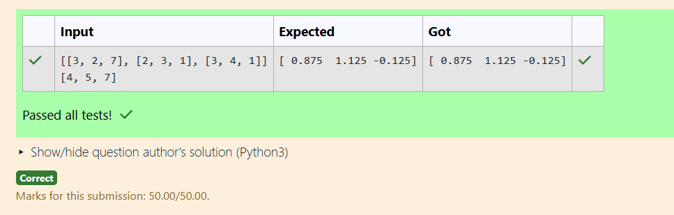

# LU Decomposition 

## AIM:
To write a program to find the LU Decomposition of a matrix.

## Equipments Required:
1. Hardware – PCs
2. Anaconda – Python 3.7 Installation / Moodle-Code Runner

## Algorithm
1. Import required libraries: numpy and lu from scipy.linalg.
2. Input the matrix A using eval(input()) and convert it to a NumPy array.
3. Decompose the matrix using lu(A) to get P, L, and U such that PA = LU.
4. Print the L (Lower) and U (Upper) matrices.

## Program:
(i) To find the L and U matrix
```
'''Program to find L and U matrix using LU decomposition.
Developed by: T.MANIKANDAN
RegisterNumber: 212224110037
'''
import numpy as np
from scipy.linalg import lu
A=np.array(eval(input()))
P,L,U=lu(A)
print(L)
print(U)
```
(ii) To find the LU Decomposition of a matrix
```
'''Program to solve a matrix using LU decomposition.
Developed by: T.MANIKANDAN
RegisterNumber: 212224110037
'''
import numpy as np
from scipy.linalg import lu_factor,lu_solve
A=np.array(eval(input()))
B=np.array(eval(input()))
piv,lu=lu_factor(A)
result=lu_solve((piv,lu),B)
print(result)
```

## Output:
(i) L and U matrix


(ii) LU decomposition of a matrix



## Result:
Thus the program to find the LU Decomposition of a matrix is written and verified using python programming.

